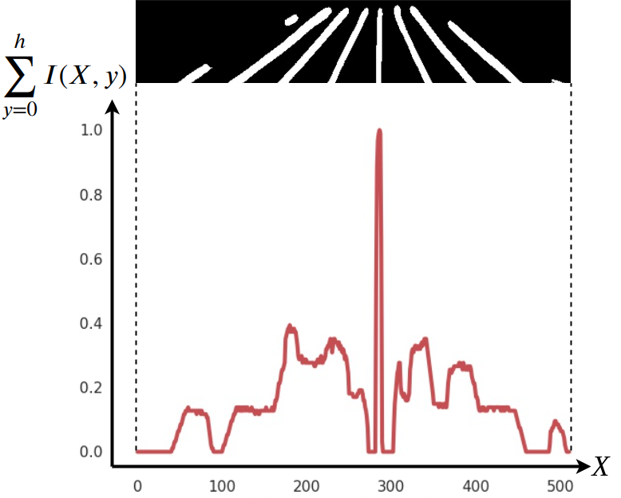
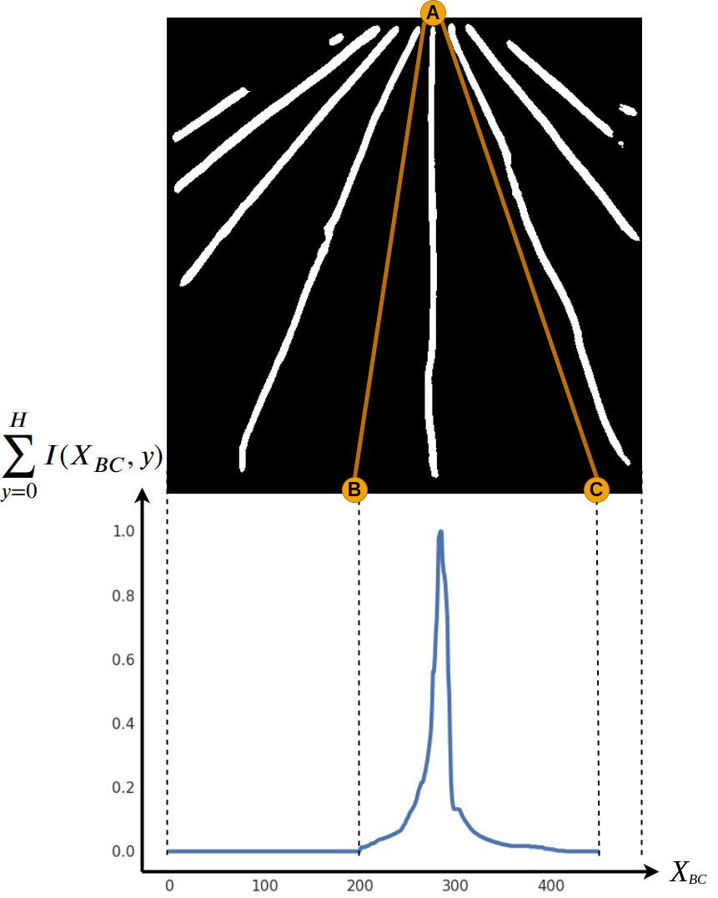
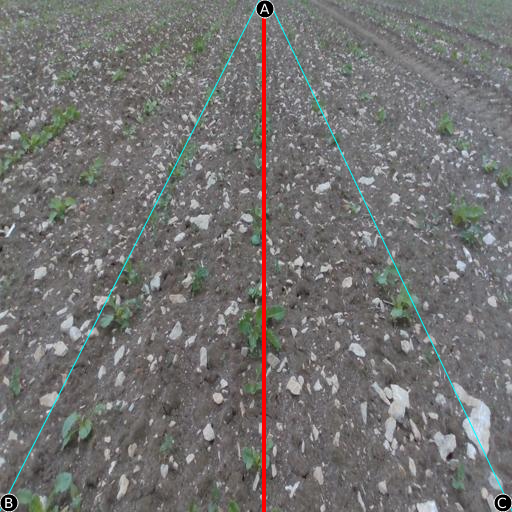

# Triangle Scan Method (TSM)

The triangle scan method is a 2-step process which determines the central crop row from a semantic skeleton segmentation of a crop row. The first step (Anchor Scan) and the second step (Line Scan) scan for the topmost (Anchor Point) and the lowermost ($P_{r}$) points of the central crop row respectively. The anchor point $A$ and point $P_{r}$ always lie on the top and bottom edges of the image respectively. These two steps are explained below.

<figure>
  
  <figcaption>Figure 1: Regions of interest for anchor scan and line scan. Anchor Scan ROI: RED, Line Scan ROI: Green. </figcaption>
</figure>

## Anchor Scans

Anchor scans stage scans a rectangular region of interest (ROI) of the predicted crop row mask as indicated in red in Figure 1. The width of the rectangular ROI is the same as the width of the image while the height of the rectangular ROI is defined by $h$ such that $h=sH$. The height of the input image is $H$ and $s$ is a scaling factor between $0$ and $1$. By default $s$ was set to $0.2$. This can be modified using --s parameter of the code. Equation 1 describes the scanning process for $A$. $I$ is the semantic skeleton segmentation prediction and $X$ represents horizontal coordinates within a predefined range in the rectangular ROI. The predefined range (0.2H to 0.7H) for $X$ was experimentally determined by observing the usual anchor point occurrence in [CRDLD dataset](https://github.com/JunfengGaolab/CropRowDetection). There values can be adjisted from setting the --Amin and --Amax arguments. $[Amin=512\times 0.2\approx 100,\enspace Amax=512\times 0.7\approx 350]$
```bash
python triangle_scan_rgb.py --Amin=100 --Amax=350
```
The anchor point is only validated if the scanner parameter: $\left( \sum_{y=0 → y=h} I(X,y) \right)$ meets an experimentally predetermined threshold value. The ROI is shifted down by a distance of $h$ (maximum up to 2 times) if the detected anchor point is invalid. This shifting down helps to identify the $A$ when the robot reaches the end of a crop row. 

$A = argmax \left( \sum_{y=0 → y=h} I(X,y) \right)   (1)$

<figure>
  
  <figcaption>Figure 2: Anchor scans distribution. </figcaption>
</figure>

## Line Scans

A triangular ROI is defined in the line scans stage with points A, B (Begin Point) and C (Cease Point) as shown in Figure 1. Equation 2 describes the scanning process for $P_{r}$ by searching for an instance of a variable point $P$ on $BC$ line which yields the highest pixel sum along $AP$ line.

$P_{r} = argmax \Biggl[ \sum_{I_{xy}=A→ I_{xy}=P} I(x,y) \Biggr]_{P=B}^{P=C} (2)$

The definition of points $B$ and $C$ are dependent on the crop height, camera mounting height and camera mounting angle. The calibration procedure outlined below allows to set the $B,C$ points at bottom left and bottom right corners of the image frame respectively. However, the $B,C$ points could be tightly defined based on additional observations relevant to a given scenario. For example, a visual servoing controller will always attempt to align the central crop row to a vertical position within the image frame. A maximum possible crop row orientation limit could be established as a prior with sufficient testing of the visual servoing setup. Such priors could be used to limit the relative offset of $B,C$ points from point $A$, leading to a lower computational time for scanning procedure given in Equation 2. Points $B$ and $C$ will always lie on the lowermost edge of the image.

<figure>
  
  <figcaption>Figure 3: Line scans distribution. </figcaption>
</figure>

## Calibration
The triangle scan method relies on the appropriate combination of mounting height and the pitch angle of the camera. The robot must be positioned as shown in Figure 4 before starting the calibration process. A calibration program will overlay 3 guidelines on the camera image stream to assist the user to position the camera as shown in Figure 5. At least one of the parameters: mounting height or the pitch angle of the camera, must be adjusted to adhere to the following set of rules.

1. The central crop row must align with the central guide line (red).
2. The adjacent crop rows to the central crop row must not **completely** lie within the lateral guide lines (blue).
3. The EOR should not be visible in the image during calibration stage.

The user is free to mount the camera at any mounting height and pitch angle as long as above conditions are met. Equation 2 yields a peak from $\sum_{I_{xy}=A→ I_{xy}=P} I(x,y)$ to determine $P_{r}$ position. The adjacent crop rows to the central crop row must be kept outside the triangular ROI (line scans ROI) to ensure the yielded peak belongs to the central crop row. To this end, the points B and C could be declared at bottom left and bottom right corners respectively, for general usage for a given calibrated camera position. 

<figure>
  
  <figcaption>Figure 4: Initial position for calibration (a. Top view of calibration position, b. Side view of calibration position). </figcaption>
</figure>

<figure>
  
  <figcaption>Figure 5: Calibration mask overlay example (Red: Central guideline, Blue: Lateral guidelines, A: Anchor point, B: Begin point, C: Cease point). </figcaption>
</figure>

## Usage
### Prerequisits
1. Install dependencies: [OpenCV, NumPy, SK-Image, Seaborn, Pandas, Matplotlib, Glob, Argparse]
```bash
pip install opencv-python numpy scikit-image seaborn pandas matplotlib glob3 argparse
```
2. Clone the repository.
```bash
git clone https://github.com/Rajitha159/TSM.git
```
3. Copy the RGB image files to "rgb" folder and predicted crop row masks to "mask" folder(all images must be resized to $512 \times 512$).
4. Run the following command to generate crop row masks and save them to "out" folder.
```bash
python triangle_scan_rgb.py
```
5. [Optional] Run the code with parameters in needed. Parameter descriptions are in table below.
Example: 
```bash
python triangle_scan_rgb.py --file_type=".png"
```

### Parameters
| Parameter         | Description                                                                                     |
| ----------------- | ----------------------------------------------------------------------------------------------- |
| `--file_type`     | Specify the file type for image files. Default is `.jpg`.                                     |
| `--A`             | Specify the standard anchor point. Default is 277.                                           |
| `--B`             | Specify the begin point (B) for line scans. Default is 200.                                  |
| `--C`             | Specify the cease point (C) for line scans. Default is 450.                                 |
| `--Amin`          | Specify the anchor scans starting point. Default is 100.                                    |
| `--Amax`          | Specify the anchor scans ending point. Default is 350.                                      |
| `--s`             | Specify the anchor scans ROI (Region of Interest) height. Default is 0.2.                   |
| `--scan_period`   | Specify the scan period for anchor and line scans. Default is 1.                            |
| `--filter_enable` | Enable the complementary filters for scanning in continuous sequential images. Default is `False`. |
| `--anchor_filter` | Specify the complementary filter strength for anchor scans. Default is 0.95.                |
| `--line_filter`   | Specify the complementary filter strength for line scans. Default is 0.95.                  |
